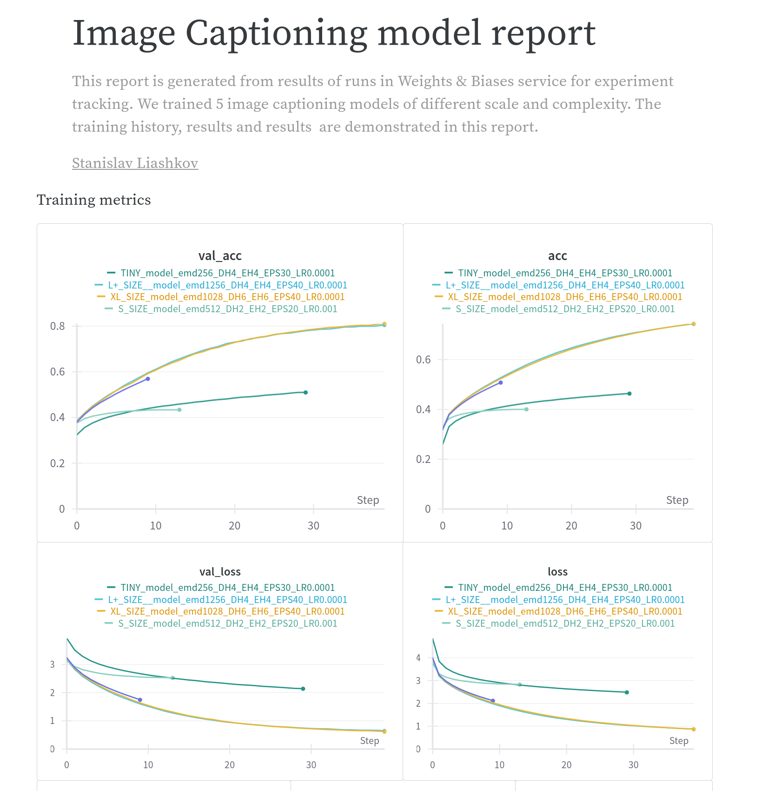

# Image Captioning model 

## Intro
This repo contains training and inference code for image captioning model (image2text).


An **image captioning model** is an artificial intelligence system designed to automatically generate textual descriptions for images. It integrates elements of computer vision to interpret visual content and natural language processing to formulate coherent sentences. The model typically processes the image through a convolutional neural network to extract visual features, and then uses a recurrent neural network or a transformer-based architecture to generate relevant captions based on those features. This technology is useful in various applications such as aiding visually impaired users, organizing image databases, and enhancing user interactions with multimedia content.
#### Examples


#### Application GUI


## Data
In this project, we used publicly available dataset **FlickR30K**.

The **Flickr30k** dataset is a popular benchmark for sentence-based picture portrayal. The dataset is comprised of **31,783** images that capture people engaged in everyday activities and events. Each image has a descriptive caption. Flickr30k is used for understanding the visual media (image) that correspond to a linguistic expression (description of the image). This dataset is commonly used as a standard benchmark for sentence-based image descriptions. 
The size is about **9GB**

Source - https://www.kaggle.com/datasets/hsankesara/flickr-image-dataset

## Model Architecture
#### Architecture diagram
The architecture of our Image captioning model consists of 3 parts:
  1) **CNN** as feature extractor from images. (EfficientNetB1 in our case)
  2) **Transformer Encoder Block** that process image embedding
  3) **Transformer Decoder Block** that generates a caption in autoregressive mode (token by token)

This architecture uses Convolution NN as a feature extractor that produces 2D "embedding" of image. Then, this "embedding" matrix produced by CNN is passed to Transformer Encoder block and then the model starts to generate caption in Transformer Decoder part. The last layer of our model is **softmax** over all words in **vocabulary**.

During the training, we keep our **vocabulary** of constants size - **10 000 words**.


## Training
Given the architecture, we are going to minimize *Sparse Categorical CrossEntropy* between softmax output and ground truth token in a position. 
As a metric of performance, we employ - **next token prediction accuracy**.

The training was done on a powerful laptop with embedded GPU - **NVIDIA GeForce RTX 4090**

From the start, I understood that the training procedure was going to be **computationlly intensive and long**, I prepared several python modules to make workflow more clean, maintainable and efficient.
  - Model architecture (model.py)
  - Data preprocessing (data_processing.py)
  - Experiment tracking and saving artifacts (training_utils.py)

### Experiment tracking
This project uses experiment tracking service called **Weights & Biases**. Weights & Biases (W&B) is the AI developer platform, with tools for training models, fine-tuning models, and leveraging foundation models.
It is fairly straightforward to set up W&B in 5 minutes, then quickly iterate on your machine learning pipeline with the confidence that your models and data are tracked and versioned in a reliable system of record


### Training script
And the main file in this repo is - **train_model.py** which is a Python script that takes all these modules and train a model with hyperparameters specified in **command line arguments** and at the same time loggin all process both **locally** and to service **Weights & Biases**.

example of usage:
```bash
./train_model.py --embed_dim 1024 --ff_dim 512 --enc_heads 4 --dec_heads 4\
                 --artifact_dir local_runs/model1_artifacts --epochs 40 --lr 0.001
```

This document provides detailed descriptions of the command line arguments available for configuration in the script. These options allow customization of model parameters and training settings.

## Arguments

- `--seq_length`: 
  - **Type**: `int`
  - **Default**: `36`
  - **Description**: Specifies the input sequence length for the model.

- `--batch_size`: 
  - **Type**: `int`
  - **Default**: `128`
  - **Description**: Defines the number of samples to work through before updating the internal model parameters.

- `--epochs`: 
  - **Type**: `int`
  - **Default**: `20`
  - **Description**: Sets the total number of complete passes through the training dataset.

- `--embed_dim`: 
  - **Type**: `int`
  - **Default**: `512`
  - **Description**: Determines the dimensionality of the embedding layer in the neural network.

- `--ff_dim`: 
  - **Type**: `int`
  - **Default**: `256`
  - **Description**: Specifies the dimensionality of the feedforward network model within the transformer.

- `--enc_heads`: 
  - **Type**: `int`
  - **Default**: `2`
  - **Description**: Sets the number of heads in the encoder part of the multi-head attention mechanism.

- `--dec_heads`: 
  - **Type**: `int`
  - **Default**: `4`
  - **Description**: Sets the number of heads in the decoder part of the multi-head attention mechanism.

- `--artifact_dir`: 
  - **Type**: `str`
  - **Default**: `./local_runs/default_run`
  - **Description**: Provides the directory path where training artifacts (like model weights and logs) will be saved.

- `--lr`: 
  - **Type**: `float`
  - **Default**: `0.001`
  - **Description**: Specifies the learning rate used in training the model.

### Training history and Results
I trained **5** models with the same architecture shown above but with different scale (50MB to 450 MB). The model names correspond to their size (e.g. XL, L, S, tiny XS). It was quite expected that larger model should certainly outperform smaller ones and that's exactly what we can see. I also have to add that all of the models reach a level of performance which is enough to generate reasonable captions. Although, the largest model is more capable in terms of catching details precisely.

You can access interactive report in WandB by this link - https://api.wandb.ai/links/stanislavliashkov/b78pmiie

train history


Models comparison


Train results


You can open jupyter notebooks in this repo that demonstrates 20 examples of captionings for small, medium and large trained models. ``(img_caption_demo_[SIZE].ipynb)``

## Deployment
I made a simple API for this model within ``/app`` folder. This folder contains ``Dockerfile`` for building an image for this app. You can use image with a model from Docker Hub by following these steps:

1) Pull docker image
   ```bash
   docker pull stanislavlia/image_cap:s_model
   ```
2) Run docker container with model server. It will deploy application to endpoint ``http://0.0.0.0:8012``
   ```
   docker run -p 8012:8012 stanislavlia/image_cap:s_model
   ```
3) Send an image for captioning using HTTP to endpoint ``http://0.0.0.0:8012/caption``
   ```
   curl -X POST -F "file=@example.jpg" http://localhost:8012/caption
   ```
It currently has 3 tags:
  - ``s_model``  - small model (about 99MB)
  - ``l_model`` - large model (about 350 MB)
  - ``xl_model`` - extra large model (about 450 MB)

### Generated Captions


### References
1) Keras example that helped a lot - https://keras.io/examples/vision/image_captioning/
2) Weights & Biases Experiment tracking free service - https://wandb.ai/site
3) Paper: Attention is All you Need, A.Vaswani et al - https://arxiv.org/abs/1706.03762
4) Paper: Deep Visual-Semantic Alignments for Generating Image Description, A. Karpathy, Li Fei-Fei - https://arxiv.org/abs/1412.2306
5) Paper: EfficientNet: Rethinking Model Scaling for Convolutional Neural Networks, Mingxing Tan, Quoc V. Le - https://arxiv.org/abs/1905.11946
